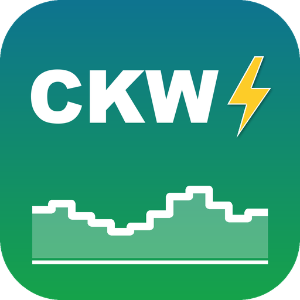

<p align="center"></p>

# LoxBerry-Plugin: CKW Dynamischer Tarif

**Nur für die Schweiz:** für Kundinnen und Kunden der CKW (Centralschweizerische Kraftwerke, Zentralschweiz) mit dynamischem Netztarif.

Holt alle 15 Minuten die dynamischen Strompreise der CKW (**CKW Netz Home dynamic** / **Business dynamic**) über die öffentliche CKW-API und stellt sie dem Loxone Miniserver per **MQTT** oder **UDP** zur Verfügung – aufbereitet für den Baustein **Spotpreis-Optimierer**.

- Netztarif und Stromprodukt (ClassicStrom, BudgetStrom, MeinRegioStrom, eigener Preis) wählbar
- Alle Komponenten einzeln: `total`, `integrated`, `grid`, `gridusage`, `gridfix`, `energy`
- Stundenreihen relativ (+0…+23), absolut (00…23) und morgen; fehlende Stunden (morgen vor ca. 12 Uhr, API-Ausfall) werden standardmässig mit dem CKW-Durchschnittspreis gefüllt
- Min/Max/Ø, günstigstes Zeitfenster, Rang der aktuellen Stunde, Online-Status
- MQTT: Abo im LoxBerry-MQTT-Gateway wird automatisch angelegt
- UDP: Loxone-Vorlage zum Herunterladen
- Neue Jahrespreise und Konzessionsabgaben der Gemeinden werden automatisch aus der maschinenlesbaren Tarifdatei der CKW übernommen (Pflicht für Netzbetreiber seit 2026)

**Doku:** [LoxBerry-Wiki](https://wiki.loxberry.de/plugins/ckwdynamic/start) · Quelle der Wiki-Seite: [`docs/wiki_ckwdynamic.dokuwiki`](docs/wiki_ckwdynamic.dokuwiki)

Voraussetzung: LoxBerry ab 3.0.

> Privates Community-Projekt, keine Verbindung zur CKW AG. Massgebend sind die offiziellen Preisblätter der CKW.

## Jahrespreise

Läuft automatisch: Das Plugin sucht täglich die maschinenlesbaren Tarifdateien (`*_tariffs.json`) auf [ckw.ch](https://www.ckw.ch/energie/strom/stromprodukte/privat) und übernimmt Energieprodukte und Gemeindeabgaben mit ihrem Gültigkeitsdatum.

Rückfall, falls CKW die Seite umbaut: [`tariffs.json`](tariffs.json) in diesem Repo (wird ebenfalls täglich geladen). Dort bei Bedarf Einträge mit `valid_from` ergänzen, `updated` anpassen und pushen.

## Entwicklung

| Pfad | Inhalt |
|---|---|
| `plugin.cfg` | Plugin-Metadaten (AUTHOR/NAME/FOLDER nie ändern) |
| `bin/ckw_lib.php` | Logik: API, Berechnung, MQTT/UDP |
| `bin/fetch.php` | Cron-Einstieg (`php fetch.php -v` für Konsolen-Log) |
| `webfrontend/htmlauth/index.php` | Weboberfläche |
| `cron/crontab` | Abruf alle 15 Minuten + nach Reboot |
| `config/` | Standard-Einstellungen, MQTT-Gateway-Abo |

Release bauen:

```bash
./build.sh
```

Danach `release.cfg` (VERSION, ARCHIVEURL) anpassen, taggen (`v0.1.6`) und GitHub-Release erstellen.

## Lizenz

MIT
